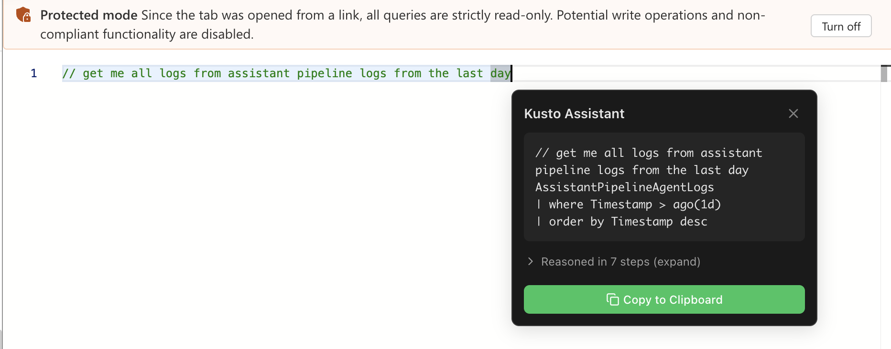

# Kusto Assistant

An AI-powered assistant for Azure Data Explorer (Kusto) that helps you write and optimize KQL queries.

## Features

- 🤖 AI-powered KQL query generation
- 🔍 Query optimization suggestions
- 📊 Context-aware assistance based on your database schema
- 🔧 Chrome extension for seamless integration with Azure Data Explorer

## Quick Start

### Prerequisites

- [Docker](https://www.docker.com/get-started) installed
- [Azure CLI](https://docs.microsoft.com/en-us/cli/azure/install-azure-cli) installed
- Azure OpenAI or OpenAI API access
- Azure Data Explorer cluster access

> ⚠️ **Windows Users:** Due to Windows DPAPI encryption, Azure CLI tokens from Windows cannot be read by Linux containers. You must use **WSL (Windows Subsystem for Linux)** to run Docker commands with Azure identity authentication. See the [Windows Setup with WSL](#windows-setup-with-wsl) section below.

### 1. Login to Azure

The assistant needs Azure credentials to access your Kusto clusters:

```bash
az login
```

### 2. Pull and Run the Docker Image

#### macOS / Linux

```bash
# Pull the latest image
docker pull crkassistprodeus2001.azurecr.io/kusto-assistant-backend:latest

# Run with Azure OpenAI (Managed Identity)
docker run -d -p 3847:3847 \
  -e LLM_PROVIDER=azure-openai-identity \
  -e AZURE_OPENAI_ENDPOINT=https://your-openai.cognitiveservices.azure.com/ \
  -e AZURE_OPENAI_DEPLOYMENT=your-deployment-name \
  -e AZURE_OPENAI_API_VERSION=2024-12-01-preview \
  -e LLM_MODEL=gpt-5.1 \
  -v ~/.azure:/root/.azure \
  crkassistprodeus2001.azurecr.io/kusto-assistant-backend:latest
```

#### Windows Setup with WSL

Windows encrypts Azure CLI tokens with DPAPI, which Linux containers cannot read. You **must** use WSL Ubuntu to run Docker with Azure identity authentication.

**Step 1: Install Ubuntu for WSL (one-time setup)**

Open PowerShell as Administrator and run:
```powershell
wsl --install -d Ubuntu
```

**Step 2: Configure Docker Desktop for WSL**

1. Open **Docker Desktop**
2. Go to **Settings → Resources → WSL Integration**
3. Enable integration with your **Ubuntu** distro
4. Click **Apply & Restart**

**Step 3: Open Ubuntu and install Azure CLI**

```powershell
wsl -d Ubuntu
```

Inside Ubuntu, run:
```bash
# Install Azure CLI
curl -sL https://aka.ms/InstallAzureCLIDeb | sudo bash

# Add yourself to docker group (to avoid using sudo)
sudo usermod -aG docker $USER
```

Exit and restart WSL:
```powershell
# In PowerShell
wsl --shutdown
wsl -d Ubuntu
```

**Step 4: Login to Azure and run the container**

Inside Ubuntu WSL:
```bash
# Login to Azure
az login

# Run the container
docker run -d -p 3847:3847 \
  -e LLM_PROVIDER=azure-openai-identity \
  -e LLM_MODEL=gpt-5.1 \
  -e AZURE_OPENAI_ENDPOINT=https://your-openai.cognitiveservices.azure.com/ \
  -e AZURE_OPENAI_DEPLOYMENT=your-deployment-name \
  -e AZURE_OPENAI_API_VERSION=2024-12-01-preview \
  -v ~/.azure:/root/.azure \
  crkassistprodeus2001.azurecr.io/kusto-assistant-backend:latest

# Verify it's running
curl http://localhost:3847/api/v1/health
```

> **Note:** You only need to run `az login` once. The tokens are stored in `~/.azure` and will be reused until they expire (~24 hours).

### 3. Install the Chrome Extension

1. Download the extension: [kusto-assistant-latest.zip](https://stkassistprodeus2001.blob.core.windows.net/extension/kusto-assistant-latest.zip)
2. Extract the zip file
3. Open Chrome and go to `chrome://extensions`
4. Enable **Developer mode** (top right)
5. Click **Load unpacked** and select the extracted folder

### 4. Verify the Backend is Healthy

Before using the assistant, make sure the backend service is running:

```bash
curl http://localhost:3847/api/v1/health
```

You should see a response like:
```json
{
  "success": true,
  "data": {
    "status": "ok",
    "details": {
      "memory_heap": { "status": "up" },
      "memory_rss": { "status": "up" },
      "storage": { "status": "up" },
      "llm": {
        "status": "up",
        "provider": "azure-openai",
        "model": "gpt-5.1"
      }
    }
  }
}
```

### 5. Use the Assistant

1. Open [Azure Data Explorer](https://dataexplorer.azure.com)
2. Write a comment describing what you want, e.g., `// get all logs from the last hour`
3. Press `Alt+K` (Windows) or `Cmd+K` (macOS) to activate the assistant
4. The AI will generate a KQL query based on your request



## Configuration Options

### Environment Variables

| Variable | Required | Description | Example |
|----------|----------|-------------|---------|
| `LLM_PROVIDER` | Yes | LLM provider to use | `azure-openai-identity`, `azure-openai-key`, `openai` |
| `LLM_MODEL` | Yes | Model name | `gpt-5.1`, `gpt-4o`, `gpt-4.1` |
| `AZURE_OPENAI_ENDPOINT` | For Azure | Azure OpenAI endpoint URL | `https://your-openai.cognitiveservices.azure.com/` |
| `AZURE_OPENAI_DEPLOYMENT` | For Azure | Azure OpenAI deployment name | `gpt-5.1` |
| `AZURE_OPENAI_API_VERSION` | For Azure | Azure OpenAI API version | `2024-12-01-preview` |
| `AZURE_OPENAI_API_KEY` | For azure-openai-key | Azure OpenAI API key | `your-api-key` |
| `OPENAI_API_KEY` | For openai | OpenAI API key | `sk-...` |
| `PORT` | No | Server port (default: 3847) | `3847` |

### LLM Provider Options

| Provider | Description | Credentials Required |
|----------|-------------|---------------------|
| `azure-openai-identity` | Azure OpenAI with managed identity (recommended) | `az login` credentials |
| `azure-openai-key` | Azure OpenAI with API key | `AZURE_OPENAI_API_KEY` |
| `openai` | OpenAI API | `OPENAI_API_KEY` |

> **Note:** The volume mount `-v ~/.azure:/root/.azure` is required for all providers to allow access to your Kusto clusters via Azure credentials.

## Health Check

Verify the backend is running:

```bash
curl http://localhost:3847/api/v1/health
```

Expected response:
```json
{
  "success": true,
  "data": {
    "status": "ok",
    "details": {
      "memory_heap": { "status": "up" },
      "memory_rss": { "status": "up" },
      "storage": { "status": "up" },
      "llm": {
        "status": "up",
        "provider": "azure-openai",
        "model": "gpt-5.1"
      }
    }
  }
}
```

## Troubleshooting

### Windows: "User does not exist in MSAL token cache" Error

This error occurs when running Docker on Windows because Windows encrypts Azure CLI tokens with DPAPI, which Linux containers cannot decrypt.

**Solution:** Use WSL Ubuntu instead of PowerShell. See [Windows Setup with WSL](#windows-setup-with-wsl) above.

### Cannot connect to Kusto cluster

Make sure you've run `az login` before starting the container:

```bash
az login
docker restart <container-id>
```

### Extension not connecting to backend

1. Check the backend is running: `curl http://localhost:3847/api/v1/health`
2. Click the extension icon and verify the status shows "Healthy"
3. Make sure port 3847 is not blocked

### LLM errors

- Verify your Azure OpenAI endpoint and deployment name are correct
- Check your API key or managed identity has access to the Azure OpenAI resource
- Ensure the model deployment is active in Azure

## Development

### Run locally without Docker

```bash
cd backend
npm install
npm run start:dev
```

### Build the extension

```bash
cd kusto-chrome-extension
npm install
npm run build
```

## License

MIT
